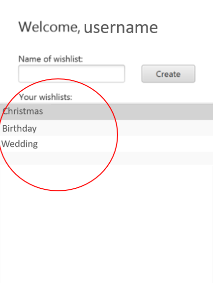

## Purpose

An app to share and receive wish lists.

## Log in (#Story-1):

As a user, I want my lists to be stored somewhere that isn’t local, so that I don’t lose them if I lose my phone.

In order to store lists, the app will save user data such as name, email and password (not yet hashed). This data will
then be stored in a JSON file called `users.wishList.json` . When opening the app, the user will therefore have to log
in to their account in order to have access to their wishlists. If the user does not have an account, they will have the
option of creating a new account. It is important that the user can see what information is needed to log in to their
account. The log in function will protect the user’s information as well.

## Important points (#Story-1):

- The user must be able to create an account
- The user must be able to log in to an existing account
- The buttons must be visible to the user
- It must be clear which information is needed
- The user data must be saved somehow

## Make wish list (#Story-2):

As a user, I want to keep track of my wishes for respective events, so that I have it ready when people ask for them.

The user needs to be able to make wish lists. When creating a wish list it is practical to be able to make different
wish lists for different events. After creating a wish list, wishes can be added to the list.

## Important points (#Story-2):

- When making a wish list: Give the list a desired name, and see all the lists the user has already made
- When adding wishes: Have the ability to see all the wishes stored in a wish list, and be able to add new ones

## Sprint 1:

During the planning of this first iteration our main goal was to implement some core functionalty such as user login and
user create list. Our processes followed this strategy:

- We created a milestone for each user story and then created subsequent issues.
- Issues was created as a way to divide a user story into its smallest parts. Issues were then assigned to individual
  members and reviewers.
- Create MR's for Issues for that one other member of the group has to review along side with GitLab CI pipeline tests.

We originally thought we had time to complete both issues, but after many hours of configuring maven and pom files we
had dug our selves into code debt.

Knowing now that our modules structure is finally working, the following Sprints can be done in a way more efficient way
and hopefully with more reviewers for merge requests.

We've completed User Story 1, with complete support for UI and Storage of users, and we've only implemented the core
functionality of use case Story-2.

# Functionality

- When the app opens, the user has to log in.

  

- If the user does not have an account, an account can be created.

  
  

- A user can make wish lists. When creating a new list, the user needs to choose a name for the wish list.
- 
- A user can see the wish lists that they own displayed on the main page.
- 
- A user can see the wishes on their wish lists. When clicking on one of the displayed wish lists, the wishes in this
  specific list will be displayed.

  
  

- A user can add wishes on their wish list. When clicking on one of the displayed wish lists, the user will have the
  option of adding items to the list.
- 
