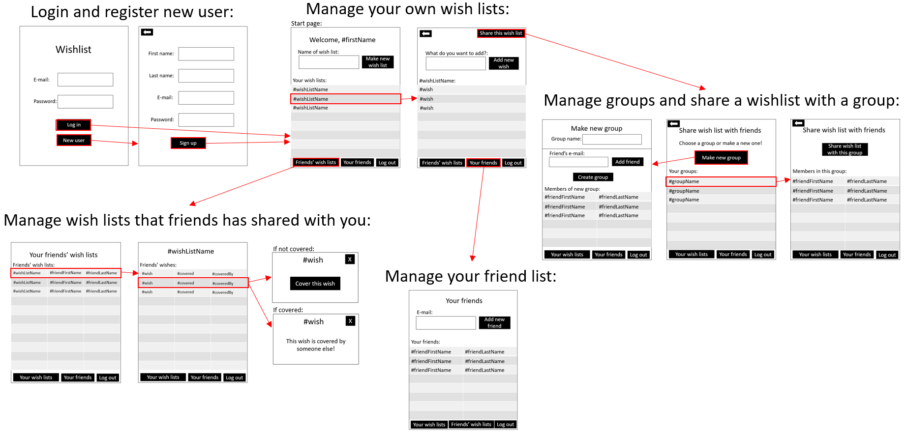

# Release 2

## Modularisation

The project is divided into modules with dependencies between modules. The build is done with `maven` and every module has their needed configuration.
The following modules are :

- **config** : Config files for Spotbugs and Checkstyle
- **core**   : Core functionality for application
- **fxui**   : FXML elements and controllers 

## Architecture (Full three-layer architecture)

The core logic seen in [**core**](./../../wishList/core/). Here also lies all our serializers and deserializers for our JSON configs [**Jackson**](./../../wishList/core/src/main/java/wishList/json/) while the ui is found in [**fxui**](./../../wishList/fxui/)

## Reflections about documentation and implicit saving.

Our architecture is currently based on two main modules **Core** and **FXUI**. 
In core we have:
- a core package with the main classes thats ment to be used throughtout the app. 
- a json package with all serializers/deserializers to be used to save app state
- a utils package that has some static pure functions that does not depend on object state. These are handy when we want to solve simple task throughout our code but we dont need to encapsulate any data. A functional way achieves this. 

In FXUI we have:
 - a ui package containing the controllers for each view
 - a resources package containing user data such as `users.json` and all fxml views. such as `LoginView.fxml`. 

### Maintaing state
Currently our applicatinon maintains state with saving objects to JSON file while also updateing that object throughout the lifecycle of the app. When closing the app our idea is to then save the state of the user object into the JSON file again. Its not yet been fully implemented but further down the road we should have a unique JSON file for each class in `core` with a unique generated id aswell. This way we can join objects together in a similar way as with `MySQL` which is something two members of the groups have played with before. 

JSON serializers and deserializers dosen't always behave the way we expect them to, so creating tests for them really helped us create safer code and make it able to store/load data from each file. 

## Code qualities

Tests have been written for the major parts of the code and using **Jacoco** we can display our test coverage.
We also use checkstyle and spotbugs to enforce good code quality. This is also being checked in the gitlab pipline checkout `.gitlab-ci.yml`. Using adequate tests and checking for build quality in the pipeline preventet the group from merging in code-breaking changes into the master branch. In order to avoid code-breaking changes we needed sufficient code coverage, we came to an agreement and found out we atleast wanted 70-80% code coverage seeing as thats whats being thought of as a good practice in the real development world. For our next iteration we plan to further implement test driven development to further our goal to implement quality code that has an expected behaviour. 

## Work routines

This iteration went much more smoothly that last iteration, some of it due to less headache with setting up maven and getting it to work across diffrent computers with different OS'. We decided to increase our test coverage to 70-80% which we clearly managed to do. While testing might cause us to end up in `code debt` it is clearly worth it seeing as we then later can easily add new functionality without causing code-breaking changes.

Like with last iteration, we named our branches after the issues they would be connected to. The issue, and therefore branch, used to revise the README files is for example called 22-change-revise-readmes. Every issue is assigned to one of the group members. The issues are all added to the milestone «Release2».

We have startet programming in pairs. For example, Natalie and Marius cooperated to write tests for everything in Core, while Axel and Synne wrote tests for FXUI and set up Checkstyle and Spotbugs. We think that this has made it possible to learn more from each other and further develop our group dynamic than we would have if we programmed alone, seeing as we had to cover different issues. It also made googling more effective, because both of the members in the pair could research the same issue.

# Sprint 2 

During the planning of this second iteration our goal was to pick up where we left off and continue furthhering the functionality of our application. We continued useing the same workflow strategy as last time seeing as we thought it worked well and kept everyone up to date as to where the project was in development. These guidelines can be found in our [Contributing.md](./../../CONTRIBUTING.md) file. 

We wanted to both increase or test coverage and we wanted a way for a user to save their wishlists. we got again halfway through our goal. Again alot of time went into fixing maven, we found out early that our folder structure did not completely match the expected structure, and thus updating this structure caused alot of havoc and left us in a big code dept. Espcially when no TA's were able to suffiiently help. This, combined with the fact that our groups is made up of students that have other courses to attend to that requires equally if not more time, led to development again falling behind. 

We completed our goal to increase our test coverage, plant umls, and we included CheckStyle and Spotbugs aswell to further enforce good code quality. 

# Plans ahead

As mentioned earlier, we want to further implement test driven development for our next iteration aswell as finishing our final user stories aswell as implementing a more database like storing in the JSON files. Following this we hope to further update our user-interface to match the prototype showcased below where we also try to use our knowledge learned from TDT4185 to accomodate universal design and make the user experience as good as possible. 

# Prototype and PlantUML

